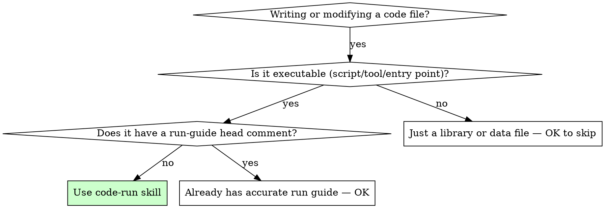

# Code Run — 运行指南头注释

## Overview

Every script, module, and tool deserves a runnable head comment. Without one, the next developer (often yourself) wastes time reverse-engineering how to execute it — which interpreter, what arguments, what dependencies, what environment.

**Core principle:** If a file can be executed, its head comment IS its run guide. No run guide → work is not done.

<HARD-GATE>
Do NOT declare any code file complete until the run-guide comment block is verified present and accurate.
</HARD-GATE>

## When to Use



**Use when:**
- Writing a new `.py`, `.sh`, `.js`, `.ts`, `.cpp`, `.go`, `.rs`, or any executable source file
- Modifying an existing file that changes how it's run (new args, new deps, new env vars)
- Refactoring that renames the file or changes the entry point
- Receiving a code file from someone else that lacks a run guide

**Do NOT use when:**
- The file is a pure library/module with no entry point (no `if __name__ == "__main__"`, no `main()`, no CLI)
- The file is a data/configuration file (`.json`, `.yaml`, `.toml`)
- The run guide already exists and the changes don't affect execution

## The Run Guide Format

Every executable file MUST begin with a comment block containing these three sections:

### Template

```python
# ============================================================
# 文件: <filename>
# 用途: <1-line purpose>
# ============================================================
# 运行方式:
#   python3 <filename> <arg1> <arg2>
#
# 参数:
#   <arg1>  — <description>
#   <arg2>  — <description>
#
# 依赖:
#   pip3 install <package>
#
# 环境变量 (可选):
#   <VAR_NAME>=<value>
#
# 示例:
#   python3 <filename> input.txt output/
# ============================================================
```

### Language-Specific Examples

**Python:**
```python
# ============================================================
# 文件: extract_bag.py
# 用途: 从 ROS2 bag 提取 RGB-D + IMU 数据为 ORB-SLAM3 格式
# ============================================================
# 运行方式:
#   python3 extract_bag.py <bag_path> <output_dir>
#
# 参数:
#   bag_path   — ROS2 .bag 文件路径
#   output_dir — 提取输出目录
#
# 依赖:
#   pip3 install pyrealsense2 rosbags opencv-python-headless numpy
#
# 示例:
#   python3 extract_bag.py /mnt/d/data/20260529_114122.bag ./extracted_data/
# ============================================================
```

**Shell:**
```bash
# ============================================================
# 文件: run_extract.sh
# 用途: 批量提取多个 bag 文件
# ============================================================
# 运行方式:
#   bash run_extract.sh <data_dir>
#
# 参数:
#   data_dir — 包含 .bag 文件的目录
#
# 依赖:
#   python3, pyrealsense2, rosbags
#
# 示例:
#   bash run_extract.sh /mnt/d/zah/
# ============================================================
```

**C++:**
```cpp
/*
 * ============================================================
 * 文件: mono_tum.cc
 * 用途: ORB-SLAM3 单目模式 TUM 数据集测试
 * ============================================================
 * 编译:
 *   cd /path/to/ORB_SLAM3 && ./build.sh
 *
 * 运行方式:
 *   ./Examples/Monocular/mono_tum <vocabulary> <config> <dataset_path>
 *
 * 参数:
 *   vocabulary    — ORBvoc.txt 路径
 *   config        — TUM 相机参数 yaml
 *   dataset_path  — TUM 序列目录
 *
 * 依赖:
 *   OpenCV 4.x, Eigen 3.3, Pangolin, DBoW2, g2o, Sophus
 *
 * 示例:
 *   ./Examples/Monocular/mono_tum Vocabulary/ORBvoc.txt \
 *       Examples/Monocular/TUM1.yaml ../datasets/rgbd_dataset_freiburg1_xyz/
 * ============================================================
 */
```

## The Process

### Step 1: Audit — Check Every File

Before committing or declaring work complete, check every file created or modified:

- [ ] Does the file have an entry point (main, CLI, `if __name__`)?
- [ ] If yes → does it have a run-guide comment at the TOP?
- [ ] If no → add one before anything else

### Step 2: Write — Fill All Three Sections

For each file that needs a run guide:

1. **File + Purpose** — what is this file, and what does it do in one sentence?
2. **Run command** — the EXACT command someone would type. Use placeholders `<like_this>` for user-specific values.
3. **Arguments** — every positional arg and flag, with description
4. **Dependencies** — packages, tools, compilers needed
5. **Example** — a concrete, real-looking invocation someone can copy-paste-adapt

### Step 3: Verify — Self-Check

After writing the run guide:

- [ ] Can I copy-paste the example and it works (modulo paths)?
- [ ] Are ALL arguments documented (no hidden flags)?
- [ ] Are dependencies listed with exact install commands?
- [ ] If the file changed, is the run guide updated?

## Red Flags

These thoughts mean STOP — you're skipping the run guide:

| Thought | Reality |
|---------|---------|
| "It's just a small script" | Small scripts are the worst to reverse-engineer. Always guide them. |
| "I'll add it later" | Later never comes. Do it NOW, before commit. |
| "The README has instructions" | READMEs get separated. The file should be self-documenting. |
| "Only I will run this" | Future-you will forget. And others might pick it up. |
| "The command is obvious" | `python3 script.py --input data/ --mode a` is never obvious. |
| "It's a one-liner" | One-liners still need a line. Cost: 30 seconds. |
| "I'm in a hurry" | Hurry is when you need the run guide most. |

## Common Mistakes

| Mistake | Why It's Wrong | Right Way |
|---------|---------------|-----------|
| Run guide at bottom of file | Nobody reads past the imports | Always at the VERY TOP, before imports |
| Vague descriptions | "input: the input" tells nothing | "input: ROS2 bag file (.bag) from RealSense D455" |
| Missing dependencies | Code fails on first run | Include pip/apt/cargo install commands |
| Outdated guide after edits | Changed args but old guide remains | Update guide WITH the code change |
| URL instead of command | "See wiki" is not a run guide | Write the command. Link to wiki as supplement. |
| Placeholder-only example | `<your_path_here>` is useless | Use a realistic path like `/mnt/d/data/bag.bag` |

## Verification Checklist

Before declaring any code file complete:

- [ ] Run-guide comment block present at the TOP of the file
- [ ] File name and one-line purpose stated
- [ ] EXACT run command shown (with placeholder args)
- [ ] Every argument documented
- [ ] All dependencies listed with install commands
- [ ] Realistic example invocation included
- [ ] Guide updated if file was modified

## Bottom Line

```
Every executable file ships with its own run manual.
No run guide at the top → the file is not complete.
```
