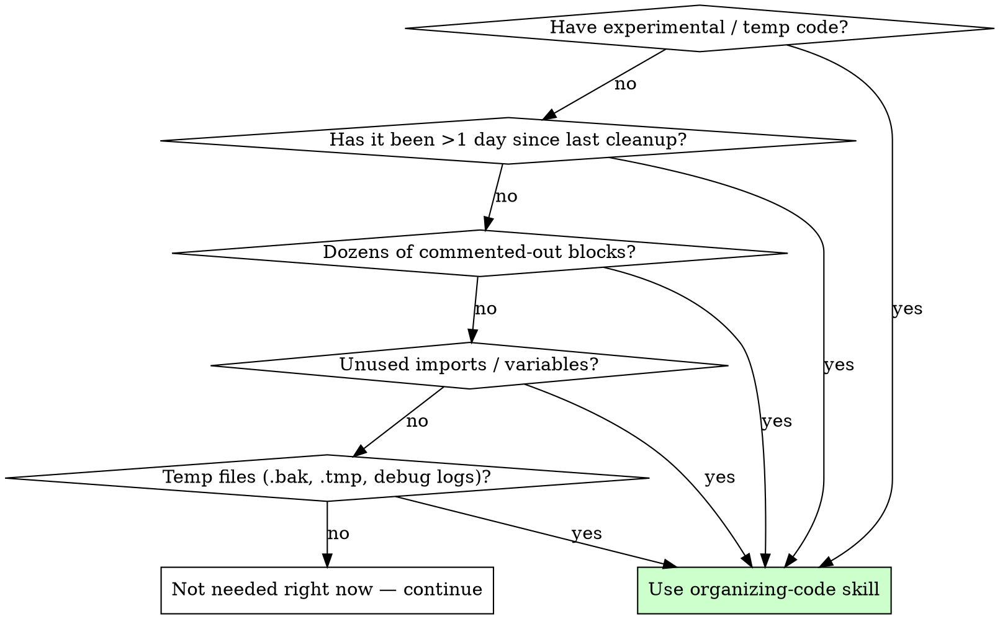

# Organizing Code — Systematic Cleanup

## Overview

Experimental branches, debugging traces, and "will need this later" code accumulate fast. Leaving them in creates noise that obscures real logic, wastes future reading time, and hides bugs.

**Core principle:** Remove what isn't used. Keep what remains clean. Do it systematically — "cleaning as you go" without a process misses half the clutter.

<HARD-GATE>
Do NOT start new feature work, commit, or declare cleanup complete until every phase below has been executed and verified.
</HARD-GATE>

## When to Use



**Use when:**
- You're switching from experimental mode to production mode
- More than one day has passed since last cleanup
- Codebase has commented-out code blocks that "might be useful later"
- Linter/compiler shows unused import or variable warnings
- You find `.bak`, `.tmp`, debug log files, or numbered-backup files
- Before committing a feature branch for review
- After completing a debugging session that added trace/logging code

**Do NOT use when:**
- The codebase is actively on fire (fix the bug first)
- You're in the middle of a complex refactor (finish, then clean)
- The clutter IS the feature (e.g., a migration script still needed)

## The Process

### Phase 1: Inventory — Find Everything

Before removing anything, catalog what exists. Use both automated tools and manual inspection.

**Automated scan:**

```bash
# 1. Find temp / backup files
find . -type f \( -name "*.bak" -o -name "*.tmp" -o -name "*.log" -o -name "*~" \) | grep -v node_modules | grep -v .git

# 2. Find numbered backup copies (file.py.1, file.py.old, etc.)
find . -type f -regex ".*\.[0-9]+$" -o -type f -name "*.old" -o -type f -name "*.orig" | grep -v node_modules | grep -v .git

# 3. List all commented-out blocks (>3 consecutive comment lines)
grep -rn "^\s*//\|^\s*#\|^\s*/\*\|^\s*\*" --include="*.py" --include="*.ts" --include="*.js" --include="*.cpp" --include="*.h" --include="*.java" . | grep -v node_modules | grep -v ".git/" | head -100
```

**Manual inspection checklist — check each file you've touched recently:**
- [ ] Imports at top — any not used by the current code?
- [ ] Commented-out code blocks — are they artifacts from debugging?
- [ ] Debug print/log statements — `print()`, `console.log()`, `logging.debug()` left from development?
- [ ] Dead variables — assigned but never read?
- [ ] Dead functions — defined but never called?
- [ ] TODO/FIXME — are they real or cruft from experimentation?
- [ ] Unused test files — tests for deleted features?

### Phase 2: Classify — Sort Into Categories

For each item found, classify it:

| Category | Meaning | Action |
|----------|---------|--------|
| **Trash** | Debug artifacts, backup copies, temp files | Delete immediately |
| **Dead code** | Unused imports, variables, functions, commented blocks | Delete — git history has it |
| **Experimental** | Code you wrote to try an approach but didn't use | Delete or move to `_archive/` |
| **Questionable** | Not sure if it's used or needed | Investigate (search_content for references) |
| **Keep but dirty** | Active code that's messy | Refactor in Phase 3 |

### Phase 3: Execute — Systematic Removal

**For TRASH:**
```bash
# Example: remove all .bak and .tmp files
find . -name "*.bak" -delete
find . -name "*.tmp" -delete
```

**For DEAD CODE — removal per file:**
1. Delete commented-out code blocks. Git has the history.
2. Remove unused imports — run your linter's auto-fix if available.
3. Remove unused variables and functions. If you're unsure, do a quick `search_content` check.
4. Remove debug print/logger statements that served their purpose.

**For EXPERIMENTAL code:**
```
If you really might need it later → move to _archive/<feature-name>/ 
Otherwise → delete. You can always git log it back.
```

**For QUESTIONABLE items:**
```bash
# Search for callers before removing
grep -rn "function_name" --include="*.py" --include="*.ts" --include="*.js" --include="*.cpp" . | grep -v node_modules | grep -v ".git/"
```

### Phase 4: Reorganize — Restore Structure

After removal, ensure the remaining code is well-organized:

1. **Group related code** — move scattered helper functions into proper modules
2. **Consistent ordering** — imports alphabetized? class members in logical order?
3. **Consistent naming** — any functions/variables named `test123`, `temp_func`, `new_new_version`?
4. **Remove stale comments** — comments that describe code that no longer exists, or "TODO: fix this" on things already fixed

### Phase 5: Verify — Confirm Cleanliness

Run the full verification suite:

```bash
# 1. Linter — should have zero issues
npm run lint  # or equivalent for your stack

# 2. Type check — no type errors
npm run typecheck  # or tsc --noEmit

# 3. Build — must compile cleanly
npm run build  # or cargo build / go build / python -m compileall .

# 4. Tests — all must still pass after deletions
npm test  # or cargo test / pytest / go test ./...

# 5. Diff review — verify no unintended changes
git diff --stat   # should only show cleanup, no feature changes
```

## Red Flags

These thoughts mean STOP — you're rationalizing keeping clutter:

| Thought | Reality |
|---------|---------|
| "I'll need this code later" | Git has the full history. Delete it. |
| "Just one more commented block won't hurt" | 5 blocks become 50. Clean it now. |
| "I'll clean up after the next feature" | You won't. Clean before, not after. |
| "This debug print is useful for debugging" | It's noise. Use a proper logger with levels. |
| "This unused import is tiny" | Tiny things add up. Remove it. |
| "Someone might use this function" | If no one calls it now, delete it. |
| "I'll move it to archive later" | Later never comes. Move now or delete. |
| "Too many files to clean" | That's exactly when the skill is needed. Start. |
| "I remember what everything does" | You won't in 2 weeks. Clean while it's fresh. |

## Common Mistakes

| Mistake | Why It's Wrong | Right Way |
|---------|---------------|-----------|
| Cleaning only new code | Clutter from 2 weeks ago is worse | Clean the whole codebase you're working in |
| Relying only on linter | Linter misses backup files, dead test code, archive dirs | Use automated scan + manual inspection |
| Deleting without checking callers | Breaks things silently | Always `grep/search_content` before deleting |
| Cleaning during feature work | Merge conflicts, lost context | Clean BEFORE starting new work or AFTER finishing a milestone |
| Leaving TODO comments as "future work" | They become permanent noise | Fix or file a real issue. No TODO ghosts. |
| Keeping "just in case" code | Code without tests rots | Delete. Tests prove intent. |

## Verification Checklist

Before declaring cleanup complete:

- [ ] No `.bak`, `.tmp`, `.log`, `*~` backup files in the workspace
- [ ] No commented-out code blocks in files you maintain
- [ ] Zero unused import/variable warnings from linter
- [ ] All debug print/logger statements removed (or behind proper log level)
- [ ] No leftover experimental scripts or test artifacts
- [ ] Build compiles without error
- [ ] All tests pass
- [ ] Git diff shows ONLY deletions and reorganizations — no feature changes
- [ ] Stale/FIXME comments for already-fixed items removed

## Bottom Line

```
Clean code is not a luxury. It is a prerequisite for reliable work.
If you didn't run the verification suite, you haven't finished cleaning.
```
